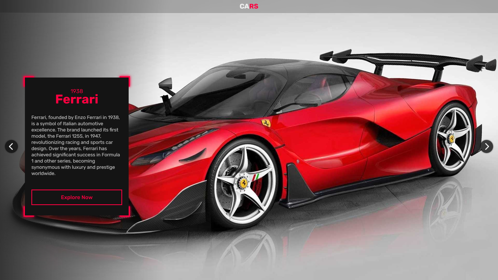

# 3 Cars Website

The website presents three cars in three different colors. It is responsive, utilizing media queries for resolutions of 1920px, 1600px, 1280px, 1024px, 768px, and 500px. The application uses React Router to change pages without reloading the entire site.

Components are created using props. The application utilizes state and localStorage to store values that remember which page you are currently on.

[**➜ Live**](https://oke225.github.io/CARS_Website/)

## ⚙️ Technologies Used

- React v.18
- React Router v.6
- TypeScript v.4
- JavaScript
- SASS
- CSS 3
- HTML 5

## 💻 Features

- Responsive
- React Router
- Carousel
- Animation SASS
- Modular Components
- State & LocalStorage

## 📄 License

The [MIT License](./LICENSE) (MIT). Please see License File for more information.

## 🔎 See Also

[GitHub profile](https://github.com/OKE225)
